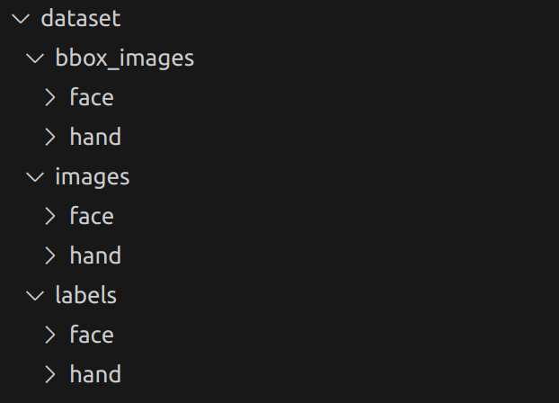
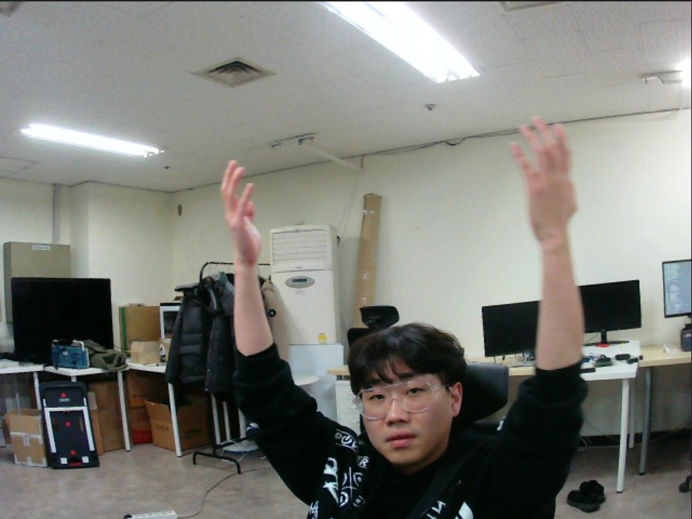
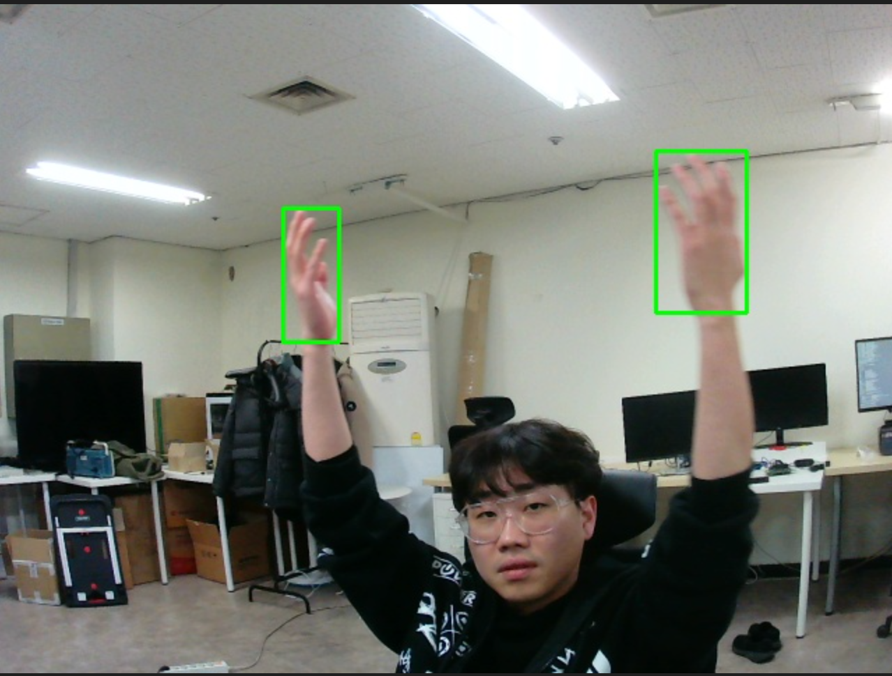

# 1. opencv + grounding dino 손 인식 및 자동 라벨링 ( in video )
## prepare
- grounding_dino 폴더에 grounding dino commit 받기 
- pretrained model 은 yolov4 tiny 사용 
- auto_label.py 에 TEXT_PROMPT 만 원하는 객체로 변경 하여 사용하면 된다. 


## Video 소스에서 TEXT_PROMPT 에 입력한 객체 인식 및 자동 분류 라벨링 및 이미지 저장.
```bash
python auto_label.py
```

## ex) face / hand


## Result
### 손 인식
label ( KITTI 포멧으로 저장 )

image 



checking bbox



```jsx
hand 0.00 0 0.00 203 146 243 242 0.00 0.00 0.00 0.00 0.00 0.00 0.00 
hand 0.00 0 0.00 470 105 535 221 0.00 0.00 0.00 0.00 0.00 0.00 0.00
```


# 3. Tao toolkit 으로 손이미지 model에 추가 학습

[Tao Custom model train (Hand with yolov4_tiny )](TAO.md) 