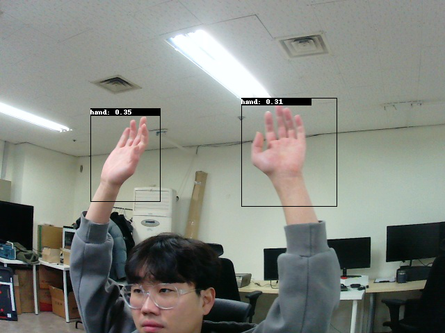

[TAO Toolkit (5.2.0)](https://docs.nvidia.com/tao/tao-toolkit/)

# Prepare

## 1. Create python virtual env

```bash
conda create -n tao_yolo python=3.7
```

## 2. Docker login

```bash
docker login nvcr.io
```

## 3. install tao

```bash
pip3 install nvidia-tao
pip3 install nvidia-pyindex
```

```bash
tao info --verbose
```

- result
    
    ```bash
    Configuration of the TAO Toolkit Instance
    
    task_group:         
        model:             
            dockers:                 
                nvidia/tao/tao-toolkit:                     
                    5.0.0-tf2.11.0:                         
                        docker_registry: nvcr.io
                        tasks: 
                            1. classification_tf2
                            2. efficientdet_tf2
                    5.0.0-tf1.15.5:                         
                        docker_registry: nvcr.io
                        tasks: 
                            1. bpnet
                            2. classification_tf1
                            3. converter
                            4. detectnet_v2
                            5. dssd
                            6. efficientdet_tf1
                            7. faster_rcnn
                            8. fpenet
                            9. lprnet
                            10. mask_rcnn
                            11. multitask_classification
                            12. retinanet
                            13. ssd
                            14. unet
                            15. yolo_v3
                            16. yolo_v4
                            17. yolo_v4_tiny
                    5.2.0-pyt2.1.0:                         
                        docker_registry: nvcr.io
                        tasks: 
                            1. action_recognition
                            2. centerpose
                            3. deformable_detr
                            4. dino
                            5. mal
                            6. ml_recog
                            7. ocdnet
                            8. ocrnet
                            9. optical_inspection
                            10. pointpillars
                            11. pose_classification
                            12. re_identification
                            13. visual_changenet
                    5.2.0-pyt1.14.0:                         
                        docker_registry: nvcr.io
                        tasks: 
                            1. classification_pyt
                            2. segformer
        dataset:             
            dockers:                 
                nvidia/tao/tao-toolkit:                     
                    5.2.0-data-services:                         
                        docker_registry: nvcr.io
                        tasks: 
                            1. augmentation
                            2. auto_label
                            3. annotations
                            4. analytics
        deploy:             
            dockers:                 
                nvidia/tao/tao-toolkit:                     
                    5.2.0-deploy:                         
                        docker_registry: nvcr.io
                        tasks: 
                            1. visual_changenet
                            2. centerpose
                            3. classification_pyt
                            4. classification_tf1
                            5. classification_tf2
                            6. deformable_detr
                            7. detectnet_v2
                            8. dino
                            9. dssd
                            10. efficientdet_tf1
                            11. efficientdet_tf2
                            12. faster_rcnn
                            13. lprnet
                            14. mask_rcnn
                            15. ml_recog
                            16. multitask_classification
                            17. ocdnet
                            18. ocrnet
                            19. optical_inspection
                            20. retinanet
                            21. segformer
                            22. ssd
                            23. trtexec
                            24. unet
                            25. yolo_v3
                            26. yolo_v4
                            27. yolo_v4_tiny
    format_version: 3.0
    toolkit_version: 5.2.0
    published_date: 12/06/2023
    ```
    

## 4. set tao mounts

이전에는 매번 도커로 명령을 날렷지만 이제는 하기와 같이 ~/.tao_mounts.json 에 입력해두고 

tao 명령만으로 이전처럼 작업 가능한것으로 보임 

- .tao_mounts.json
    
    ```json
    {
        "Mounts": [
            {
                "source": "/home/dghwang/work/yolov4_tiny/dataset",
                "destination": "/workspace/tao-experiments/data"
            },
            {
                "source": "/home/dghwang/work/yolov4_tiny/result",
                "destination": "/workspace/tao-experiments/results"
            },
            {
                "source": "/home/dghwang/work/yolov4_tiny/specs",
                "destination": "/workspace/tao-experiments/specs"
            }
        ],
        "Envs": [
            {
                "variable": "CUDA_DEVICE_ORDER",
                "value": "PCI_BUS_ID"
            }
        ],
        "DockerOptions": {
            "shm_size": "16G",
            "ulimits": {
                "memlock": -1,
                "stack": 67108864
            },
            "user": "1000:1000",
            "ports": {
                "8888": 8888
            }
        }
    }
    ```
    

- 폴더 구조
    
    ```bash
    ├── dataset
    
    │   ├── testing
    │   │   └── image
    │   │       ├── 0.png
    │   │       ├── 39.png
    │   └── training
    │       ├── image
    │       │   ├── 0.png
    │       │   ├── 126.png
    │       └── label
    │           ├── 0.txt
    │           ├── 126.txt
    ├── extdir
    ├── pretrained_model
    │   └── pretrained_object_detection_vcspdarknet_tiny
    │       └── cspdarknet_tiny.hdf5
    ├── result
    ├── specs
    │   ├── hand_tfrecords_kitti.txt
    └── tfrecords
    ```
    

## 5. Download pretrained model

```python
ngc registry model download-version nvidia/tao/pretrained_object_detection:cspdarknet_tiny --dest pretrained_model
```

---

# Train

## 1. Generate tfrecords

```bash
tao model yolo_v4_tiny dataset_convert \
-d /workspace/specs/tfrecords.txt \
-o /workspace/tfrecords/
```

## 2. Run TAO training

```bash
tao model yolo_v4_tiny train \
-e /workspace/specs/train.txt \
-r /workspace/unprune_model
```

## 3. Evaluate trained models

```bash
tao model yolo_v4_tiny evaluate \
-e /workspace/specs/train.txt \
-m /workspace/unprune_model/weights/yolov4_cspdarknet_tiny_epoch_080.hdf5
```

## 4. Prune trained model

```bash
tao model yolo_v4_tiny prune \
-m /workspace/unprune_model/weights/yolov4_cspdarknet_tiny_epoch_080.hdf5 \
-e /workspace/specs/train.txt \
-o /workspace/prune_model/pruned_yolov4_tiny.hdf5 \
-eq intersection \
-pth 0.1
```

## 5. inference

```bash
tao model yolo_v4_tiny inference \
-i /workspace/dataset/testing/image \
-e /workspace/specs/train.txt \
-m /workspace/prune_model/pruned_yolov4_tiny.hdf5 \
-r /workspace/inference/
```



인식률을 높이려면 이미지를 더 많이 넣어야것지만 우선 조금 부족해도, 된다!

## 6. model export

hdf5 to onnx

```bash
tao model yolo_v4_tiny export \
-m /workspace/prune_model/pruned_yolov4_tiny.hdf5 \
-o /workspace/export/my_model.onnx \
-e /workspace/specs/train.txt \
--target_opset 12 \
--gen_ds_config
```

labels.txt , model.onnx, nvinfer_config.txt 파일이 떨어진다. 

onnx to TensorRT engine

```bash
tao deploy yolo_v4_tiny gen_trt_engine \
-m /workspace/export/my_model.onnx \
-e /workspace/specs/train.txt \
--batch_size 16 \
--min_batch_size 1 \
--opt_batch_size 8 \
--max_batch_size 16 \
--data_type fp32 \
--results_dir /workspace/export \
--engine_file /workspace/export/my_model.engine
```

## 7. Use Deepstream

```bash
deepstream-app -c deepstream_config.txt 
Warning: 'input-dims' parameter has been deprecated. Use 'infer-dims' instead.
0:00:01.784972466  7506 0x55f2be603a60 WARN                 nvinfer gstnvinfer.cpp:679:gst_nvinfer_logger:<primary_gie> NvDsInferContext[UID 1]: Warning from NvDsInferContextImpl::initialize() <nvdsinfer_context_impl.cpp:1243> [UID = 1]: Warning, OpenCV has been deprecated. Using NMS for clustering instead of cv::groupRectangles with topK = 20 and NMS Threshold = 0.5
0:00:05.515190219  7506 0x55f2be603a60 INFO                 nvinfer gstnvinfer.cpp:682:gst_nvinfer_logger:<primary_gie> NvDsInferContext[UID 1]: Info from NvDsInferContextImpl::deserializeEngineAndBackend() <nvdsinfer_context_impl.cpp:2092> [UID = 1]: deserialized trt engine from :/home/dghwang/work/vision/export/trt.engine
INFO: ../nvdsinfer/nvdsinfer_model_builder.cpp:610 [FullDims Engine Info]: layers num: 5
0   INPUT  kFLOAT Input           3x384x1248      min: 1x3x384x1248    opt: 8x3x384x1248    Max: 16x3x384x1248   
1   OUTPUT kINT32 BatchedNMS      1               min: 0               opt: 0               Max: 0               
2   OUTPUT kFLOAT BatchedNMS_1    200x4           min: 0               opt: 0               Max: 0               
3   OUTPUT kFLOAT BatchedNMS_2    200             min: 0               opt: 0               Max: 0               
4   OUTPUT kFLOAT BatchedNMS_3    200             min: 0               opt: 0               Max: 0               

0:00:05.668773609  7506 0x55f2be603a60 INFO                 nvinfer gstnvinfer.cpp:682:gst_nvinfer_logger:<primary_gie> NvDsInferContext[UID 1]: Info from NvDsInferContextImpl::generateBackendContext() <nvdsinfer_context_impl.cpp:2195> [UID = 1]: Use deserialized engine model: /home/dghwang/work/vision/export/trt.engine
0:00:05.671101256  7506 0x55f2be603a60 INFO                 nvinfer gstnvinfer_impl.cpp:328:notifyLoadModelStatus:<primary_gie> [UID 1]: Load new model:/home/dghwang/work/vision/export/nvinfer_config2.txt sucessfully

Runtime commands:
        h: Print this help
        q: Quit

        p: Pause
        r: Resume

NOTE: To expand a source in the 2D tiled display and view object details, left-click on the source.
      To go back to the tiled display, right-click anywhere on the window.

** INFO: <bus_callback:301>: Pipeline ready

** INFO: <bus_callback:287>: Pipeline running

0:00:06.367740546  7506 0x55f2bdf4bf60 ERROR                nvinfer gstnvinfer.cpp:676:gst_nvinfer_logger:<primary_gie> NvDsInferContext[UID 1]: Error in NvDsInferContextImpl::parseBoundingBox() <nvdsinfer_context_impl_output_parsing.cpp:59> [UID = 1]: Could not find output coverage layer for parsing objects
0:00:06.367766231  7506 0x55f2bdf4bf60 ERROR                nvinfer gstnvinfer.cpp:676:gst_nvinfer_logger:<primary_gie> NvDsInferContext[UID 1]: Error in NvDsInferContextImpl::fillDetectionOutput() <nvdsinfer_context_impl_output_parsing.cpp:735> [UID = 1]: Failed to parse bboxes
```

config 파일을 잘못 정의햇는지 ..실행이 잘되지 않음.. 

Custom model 은 bbox parser를 작성해줘야 하는거같다.. 

custom-lib-path 부분에 넣어줘야하는데 

deepstream_tao_app 에 yolov4_tiny 예제 가 있기에 참조하여  만듦

property 내용들은 

model export 할때 떨어지는 config 파일을 참조하여 파라메터 수정 해주면 된다 .

 

[GitHub - NVIDIA-AI-IOT/deepstream_tao_apps: Sample apps to demonstrate how to deploy models trained with TAO on DeepStream](https://github.com/NVIDIA-AI-IOT/deepstream_tao_apps/tree/master)

```bash
property:
  gpu-id: 0
  net-scale-factor: 1.0
  offsets: 103.939;116.779;123.68
  model-color-format: 1
  labelfile-path: labels.txt
  model-engine-file: ./trt.engine
  onnx-file: ./my_model.onnx
  infer-dims: 3;384;1248
  maintain-aspect-ratio: 0
  batch-size: 1
  ## 0=FP32, 1=INT8, 2=FP16 mode
  network-mode: 0
  num-detected-classes: 1
  interval: 0
  gie-unique-id: 1
  network-type: 0
  cluster-mode: 3
  output-blob-names: BatchedNMS
  parse-bbox-func-name: NvDsInferParseCustomBatchedNMSTLT
  custom-lib-path: ../post_processor/libnvds_infercustomparser_tao.so

#people
class-attrs-0:
  #threshold: 0.5
  pre-cluster-threshold: 0.4
  #post-cluster-threshold: 0.4
  #dbscan-min-score: 0.5
  nms-iou-threshold: 0.6
  topk: 20
```